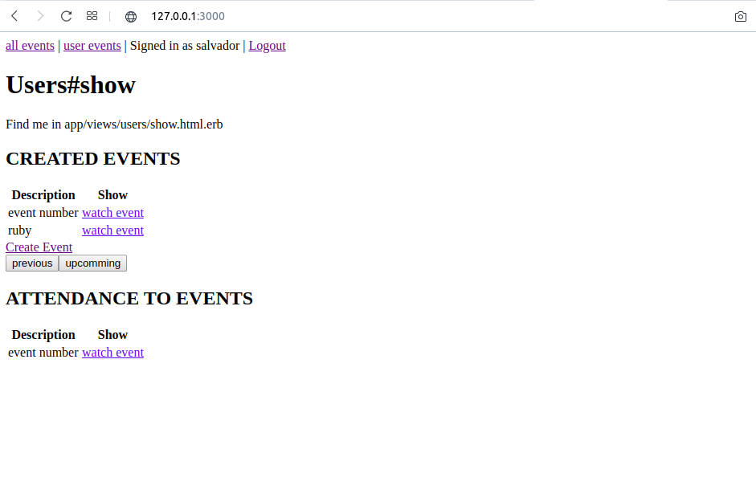

# Private Events project

Seventh Ruby on Rails Microverse Project By Salvador Olvera &amp; Oscar Russi

# What it does

- It has 3 models: User , Attendance, Event
- The User has 2 attributes: name, email
- The Attendance has 2 attributes: user_id, event_id
- The Event has 2 attributes: description, location, event_date, creator_id

- In the front-end we can create new users, log in, and display the events of the user, and thre previous and upcoming events 

- We add the validation test using Rspec for unit test and Capibara for integrattion test

# How to run this project

- Install ruby
- Install ruby on rails
- Install bundle
- Run "bundle install" inside folder
- Run "rails server" inside folder
- Go to http://127.0.0.1:3000/

#### and deployed to GitHub

## Authors

**Salvador Olvera**
- Linkedin: [Salvador Olvera](https://www.linkedin.com/in/salvador-olvera-n)
- Github: [@Salvador-ON](https://github.com/Salvador-ON)
- Twitter: [@Salvador Olvera_ON](https://twitter.com/Salvador_ON) 

**Oscar Russi**
- Github: [@andresporras3423](https://github.com/andresporras3423/)
- Linkedin: [Oscar Russi](https://www.linkedin.com/in/oscar-andr%C3%A9s-russi-porras-053236167/)

## � Contributing

This is a project for educational purposes only. We are not accepting contributions.

## Attributions and Credit

Special thanks to Microverse, for this learning opportunity. 

## Show your support

Give a ⭐️ if you like this project!

## Enjoy!